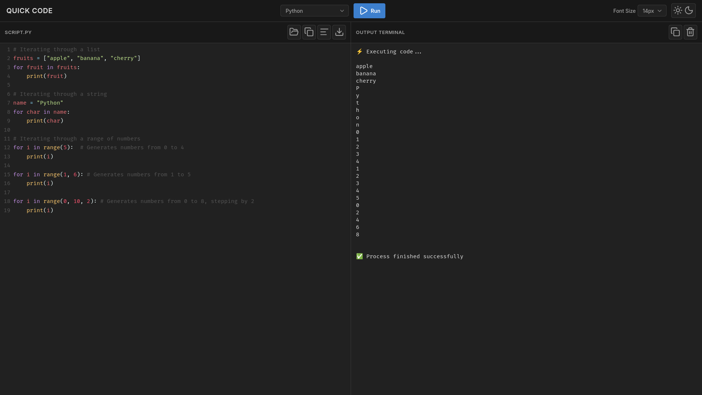
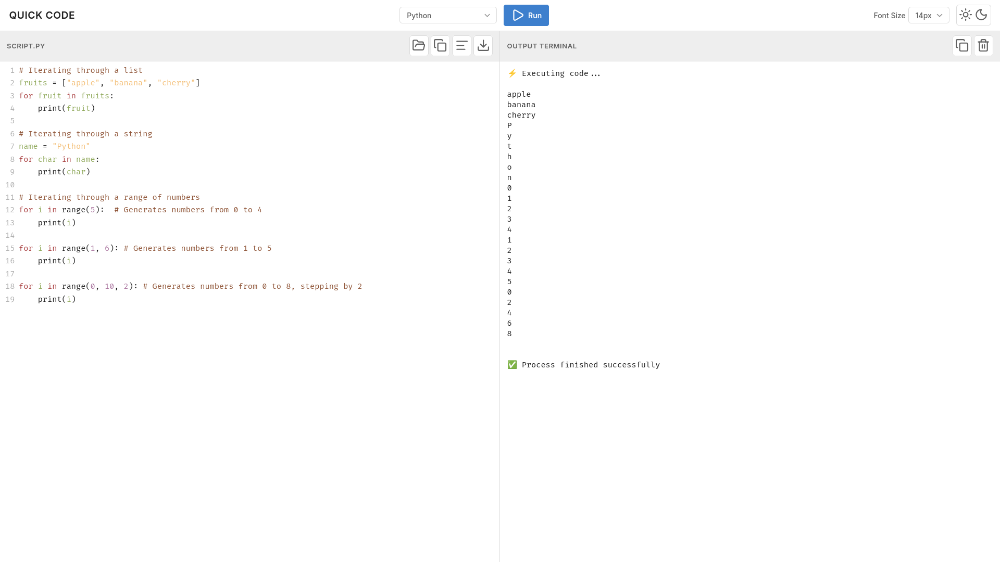
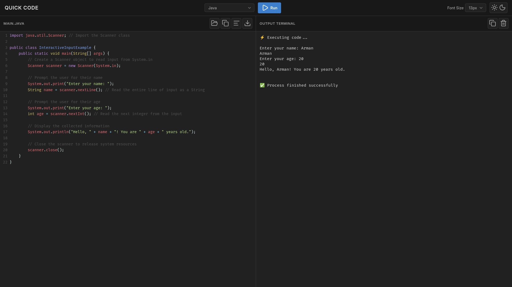
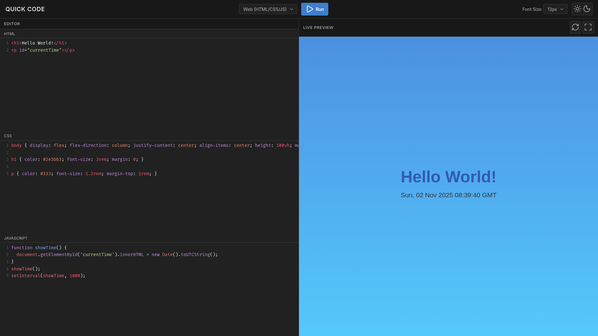

# QUICK CODE — Online IDE

A fast, minimal, real-time browser IDE built with Django + Channels and CodeMirror. Run Python, C, C++, Java, or live Web (HTML/CSS/JS) with streaming output, interactive input, theme toggle, and a clean split-view UI.

## 📸 Screenshots

### Dark Mode Interface


### Light Mode Interface


### Java with Interactive Input


### Web Live Preview


## Recommended Operating System
*   Linux - Debian(Ubuntu etc) / RHEL(Fedora etc)

## Features

*   **Multi-language execution**: Python, C, C++, Java, Web (HTML/CSS/JS).
*   **Real-time output streaming**: Via WebSockets.
*   **Interactive input**: Type directly into the terminal when programs wait for input.
*   **Live web preview**: With HTML/CSS/JS editors and auto-refresh.
*   **Theme toggle**: Dark/light modes.
*   **Font size control**, code formatting, copy/download.
*   **Minimal UI**: With a fixed split and a clear dividing line.
*   **Java memory-safe execution**: Flags to avoid heap errors.

## Project structure

├── manage.py # Django entrypoint
├── core/settings.py # Django settings (ASGI enabled)
└── editor/
├── templates/editor/index.html # App UI
├── static/editor/css/style.css # Complete UI theme
├── static/editor/js/main.js # Editor logic and WebSocket client
├── consumers.py # Code execution WebSocket backend
├── routing.py # WebSocket route mapping
└── urls.py # HTTP routes

## Prerequisites

*   Python 3.11+ recommended
*   Java JDK 11+ (`javac`/`java` on PATH)
*   GCC and G++ (for C/C++)
*   Node not required (CodeMirror via CDN)

## Quick start

1.  **Clone and setup**
    ```bash
    git clone <repository-url>
    cd <repository-name>
    ```

2.  **Create and activate venv**
    ```bash
    python -m venv venv
    source venv/bin/activate  # Windows: venv\Scripts\activate
    ```

3.  **Install requirements**
    ```bash
    pip install -r requirements.txt
    ```

4.  **Migrate and run**
    ```bash
    python manage.py migrate
    python manage.py runserver
    ```

5.  **Open in browser**
    (http://127.0.0.1:8000/)

## How to use

1.  Select a language from the top center dropdown.
2.  For **Web mode**, edit HTML/CSS/JS in their editors and see the Live Preview.
3.  For **Python/C/C++/Java**, type code in the main editor and press **Run**.
4.  **Interactive input**: When a program expects input (e.g., Java `Scanner`), type directly into the terminal and press **Enter**.
5.  **Copy and download**: Use the toolbar to copy code/output or download files.
6.  **Theme and font size**: Toggle the theme and adjust the editor font size from the header.

## Language notes

### Python
*   Runs with `python3 -u` so output streams immediately.

### C/C++
*   Compiles with `gcc`/`g++` into `/tmp`.
*   Basic flags are used; link `libm` for math in C if added later.

### Java
*   Detects the class that contains `main(String[] args)` or `public class`.
*   Compiles the file named after the `public class` (if present).
*   Runs with constrained memory to avoid VM init errors:
    *   `javac -J-Xms32m -J-Xmx128m`
    *   `java -Xms32m -Xmx128m`
*   If the program waits for input (e.g., `Scanner`), type numbers in the terminal and press **Enter**.

### Web (HTML/CSS/JS)
*   Live sandboxed preview (`allow-scripts allow-same-origin`).
*   Auto-refresh on changes and a manual **Refresh** button.

## Security and limits

*   Code runs under a PTY with streaming IO.
*   Consider adding CPU/memory/time limits (e.g., the `resource` module on POSIX) for production.
*   This is a development-grade runner; sandboxing/isolating untrusted code is out of scope here.

## Environment variables (optional)

*   `JAVA_TOOL_OPTIONS`: Global JVM flags (e.g., `-Xms32m -Xmx128m -XX:+UseSerialGC`).
*   `DJANGO_SETTINGS_MODULE`: If using multiple settings.

## Extending

*   **Add languages**: Implement a new branch in `prepare_command(language, code)` in `consumers.py`.
*   **Java packages**: Compile with `-d temp_dir` and run with `-cp temp_dir package.MainClass`.
*   **Persist files**: Replace `/tmp` with a workspace directory and add cleanup policies.

## Appendix — key files (ready to paste)

*   **index.html**: Contains `<!DOCTYPE html>`, CDN links for CodeMirror themes and modes, and `DEMO_SNIPPETS` for quick testing.
*   **style.css**: Includes the professional/minimal theme, fixed 50/50 split, visible divider between panes, dark/light variants, and CodeMirror Eclipse+Material themes.
*   **main.js**: Initializes CodeMirror instances, language switching, live preview, run/stop over WebSockets, terminal input, copy/format/download controls, theme/font preferences, and UI toasts.
*   **consumers.py**: Async Channels consumer that:
    *   Prepares compile/run commands per language.
    *   Streams output over WebSockets using a PTY.
    *   Handles interactive input and graceful termination.
    *   Detects Java classes (`public class` or any class with `main`).
    *   Uses low-memory JVM flags for `javac`/`java` to avoid heap issues.
    *   Safely cleans up temp files.

## Author

*  Armandeep Singh.
